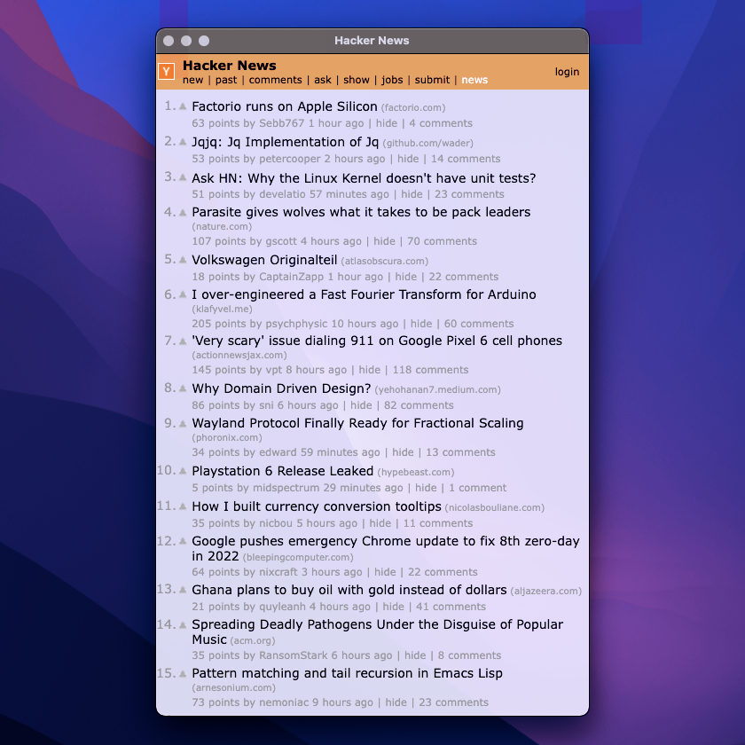

# :ocean: Liquid

Liquid is a tool that turns web pages into desktop applications.

## Features

| | Transparent websites |
|:-|:-:|
| Liquid is capable of making websites appear semi-opaque, utilizing 32 bits of depth instead of typical 24. Not only this increases the amount of information on the screen, it literally adds one more creative dimension to web design, giving a glance at how the web will visually transform after mass adoption of transparent OLED screens. |  |

| Full control and complete isolation | |
|:-:|:-|
|  | Inspired by software such as Docker and Virtual Box, Liquid app windows behave a lot like separate mobile device emulators rather than browser windows, providing full control over the encapsulated website, preventing it from accessing or performing actions without user's permission. Those can be things such as: accessing unwanted network resources, entering full-screen mode, displaying desktop notifications, opening pop-up windows, playing sounds, using third-party cookies, etc. Long story short, it puts the user back in control over what happens to their data and what actions the website is capable of performing. |

| | Next-generation snapshots |
|-:|:-:|
| PNG snapshots of Liquid apps that feature semi-opaque background will retain their transparency when saved to disk. Additionally, support for vector (SVG) snapshots is another great feature that will ensure impeccable quality of the saved visual representation of the page. Both raster and vector snapshots can be made in viewport and full-page modes. |  |

| Saving web page as single HTML file | |
|:-:|:-|
|  | Similarly to MHT and Webarchive formats, Liquid is capable of saving current page as monolithic HTML documents by utilizing data URLs, which makes it much easier to store, share, and edit those files. |
